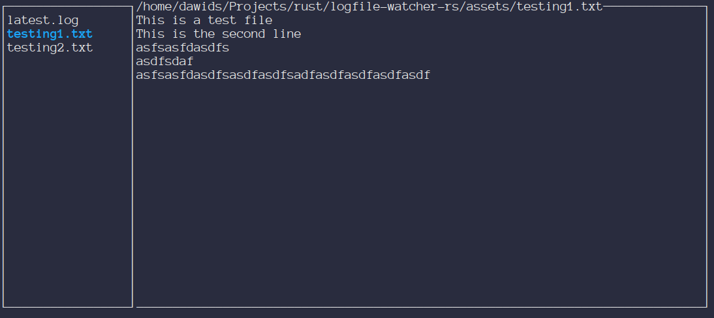

# logfile-watcher-rs

 

`logfile-watcher-rs` consists of a client and server application that allows real time remote viewing of files over a websocket. Configuration for the application is stored in a toml file. Example configuration files for client and server can be found [here](./assets/example_client_config.toml) and [here](./assets/example_server_config.toml).

## goals
Avoid bloat, write code myself instead of relying on another package (within reason).
Do no put any platform independant logic outside of main / top level directory.
Elm user interface design philosophy.
Rely much less on the glob operator (use <example>::* )

## Current design

## To Do
Windows input handing i.e. corssterm input handling in src/events.rs