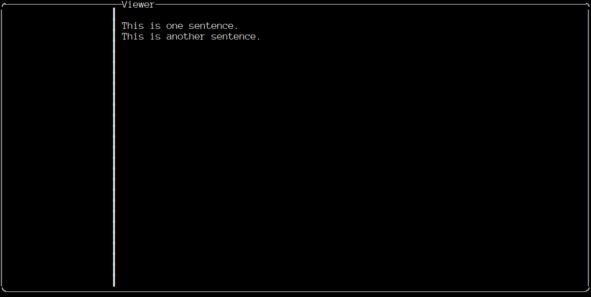

# logfile-watcher-rs

This is a client + server application that allows real time viewing of remote logfiles over a websocket.

## For dev
The execution for the client starts at client/main.rs . In main(), the backend is initialized based on the os you want to compile for. A config is read from file that contains user information/preferences. A tui::Terminal object is made and sent to a run_client function along with the config. The run_client() contains the main loop. An event loop is started to read user input. A UIState struct is made to manage the UIState.

The main loop runs the run::update() function to update the client based on the user events, ui state and configuration. If the program should continue, it retures true, if its time to exit it return false. Then the draw::draw_client() is called to draw the client based on modification made to UIState by update().
## TODO:

Rework the event loop mechanism

Websocket api

Serverside stuff